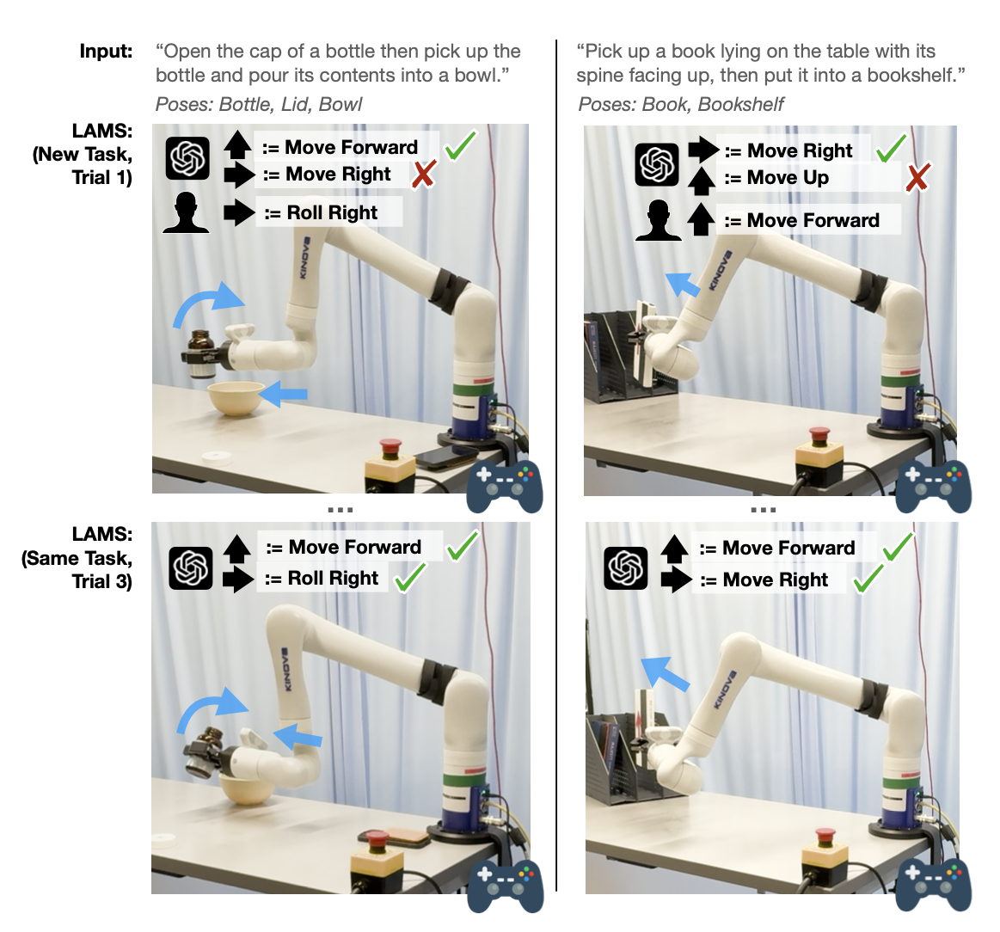

<div align="center">
  
  
  # LAMS: LLM-Driven Automatic Mode Switching for Assistive Teleoperation
  ### HRI 2025
</div>

<div align="center">
  
</div> 

<p align="left">
    <a href='https://arxiv.org/abs/2501.08558'>
      
    </a>
    <a href='https://lams-assistance.github.io/'>
      
    </a>
</p>
This is the official repo for the paper:  


**[LAMS: LLM-Driven Automatic Mode Switching for Assistive Teleoperation](https://lams-assistance.github.io/)**  
[Yiran Tao*](https://yirantao1000.github.io/), [Jehan Yang*](https://jehanyang.github.io/), [Dan Ding](https://www.shrs.pitt.edu/people/dan-ding), [Zackory Erickson](https://zackory.com/)

_Accepted to HRI 2025_


> Teleoperating robotic manipulators via interfaces like joysticks often requires frequent switching between control modes, where each mode maps joystick movements to specific robot actions. LAMS (LLM-Driven Automatic Mode Switching) is a novel approach that leverages Large Language Models (LLMs) to automatically switch control modes based on task context. LAMS requires no prior task demonstrations and incrementally improves by integrating user-generated mode-switching examples.


This repository provides the official implementation of LAMS, designed for experiments with a Kinova robotic arm.

<!-- ## Table of Contents
- [Setup](#setup) -->
  <!-- - [RoboGen](#RoboGen)
  - [OMPL](#Open-Motion-Planning-Library)
  - [Dataset](#dataset) -->
<!-- - [Run LAMS](#lams) -->
  <!-- - [Automated Task Generation & Skill Learning](#One-click-for-all) -->


## Setup

1. **Clone the repository**:
   ```bash
   git clone https://github.com/yirantao1000/lams.git
   ```

2. **Set up a conda environment**:
   We recommend using a conda environment to manage dependencies.
   ```bash
   conda env create -f environment.yaml
   conda activate lams
   ```
   If installing from the `environment.yaml` file fails, manually install any missing packages.

3. **Set up OpenAI API**:
   Add your OpenAI API key in `gpt_api.py`:
   ```python
   self.client = OpenAI(api_key="your_api_key")
   ```


## Running LAMS

LAMS supports different tasks. Below are examples of how to execute them:

1. **Book Storage Task**:
   ```bash
   python main.py --config_path configs/book.json
   ```

2. **Water Pouring Task**:
   ```bash
   python main.py --config_path configs/water.json
   ```
   
LAMS does not require any task-specific examples or demonstrations to work. Feel free to explore tasks beyond the above two we presented in the paper. To try a different task, simply modify the corresponding values in the configuration file.

### Incremental Improvement

- Simply run the same code multiple times to enable incremental improvement.
- LAMS automatically:
  - Creates an `examples` folder and saves user-generated examples.
  - Creates a `rules` folder and updates summarized rules.
  - Modifies `example_index` and `interact_index` in the config file.


<!-- ## Acknowledgements
- The interface between OMPL and pybullet is based on [pybullet_ompl](https://github.com/lyfkyle/pybullet_ompl).
- Part of the objaverse annotations are from [Scalable 3D Captioning with Pretrained Models](https://arxiv.org/abs/2306.07279) -->

## Citation
If you find this codebase/paper useful for your research, please consider citing:
```
@misc{tao2025lamsllmdrivenautomaticmode,
      title={LAMS: LLM-Driven Automatic Mode Switching for Assistive Teleoperation}, 
      author={Yiran Tao and Jehan Yang and Dan Ding and Zackory Erickson},
      year={2025},
      eprint={2501.08558},
      archivePrefix={arXiv},
      primaryClass={cs.RO},
      url={https://arxiv.org/abs/2501.08558}, 
}
```
